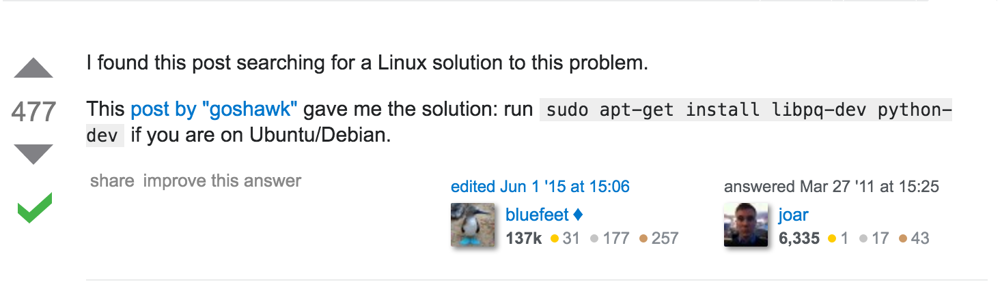
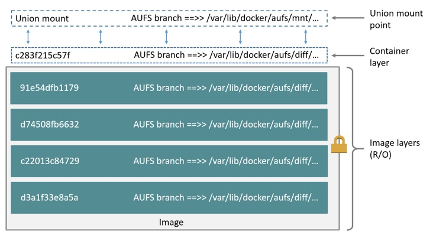
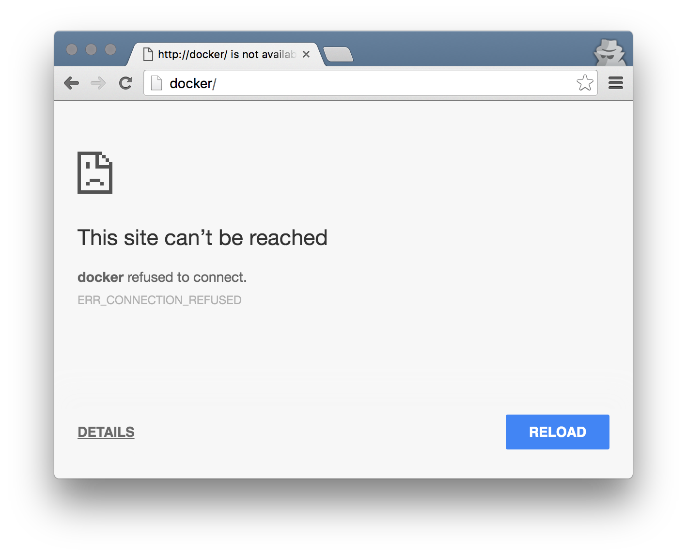
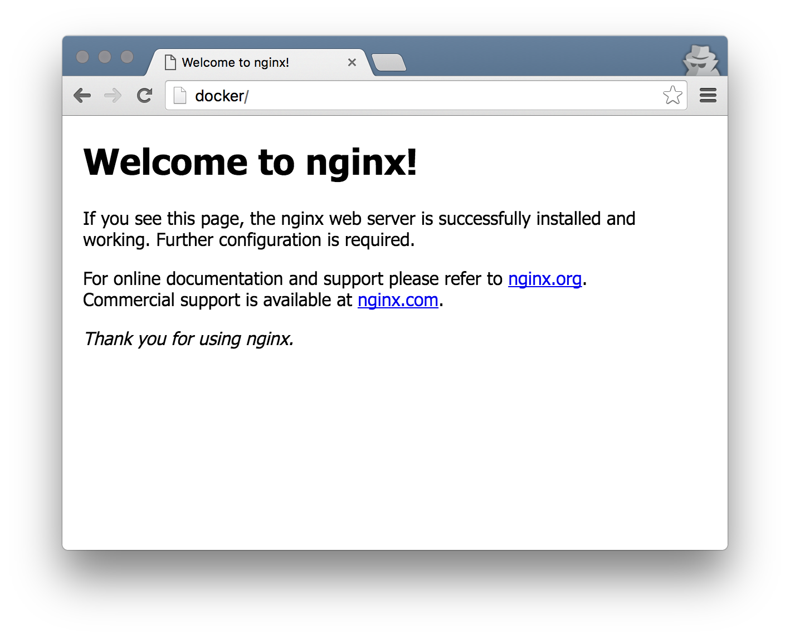
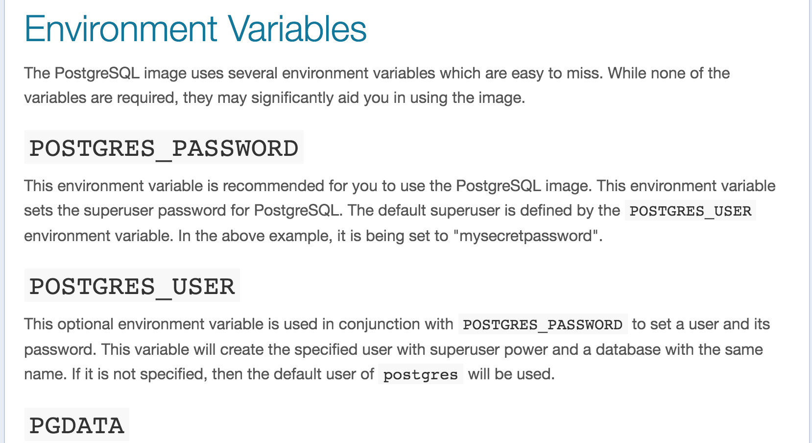
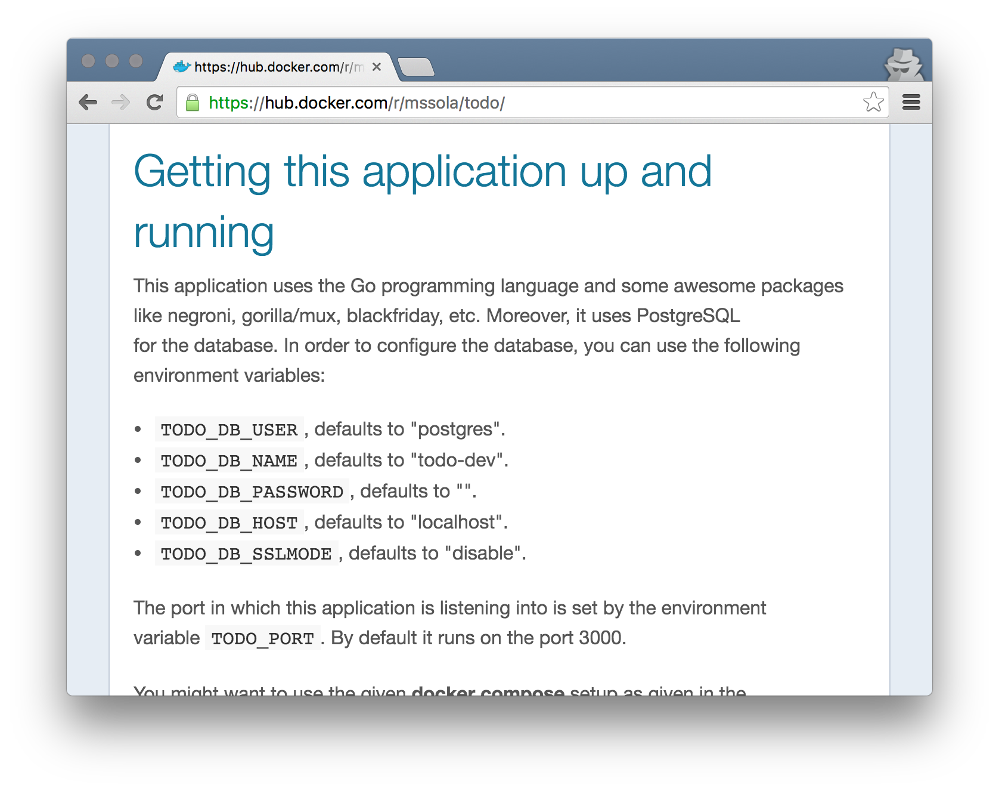
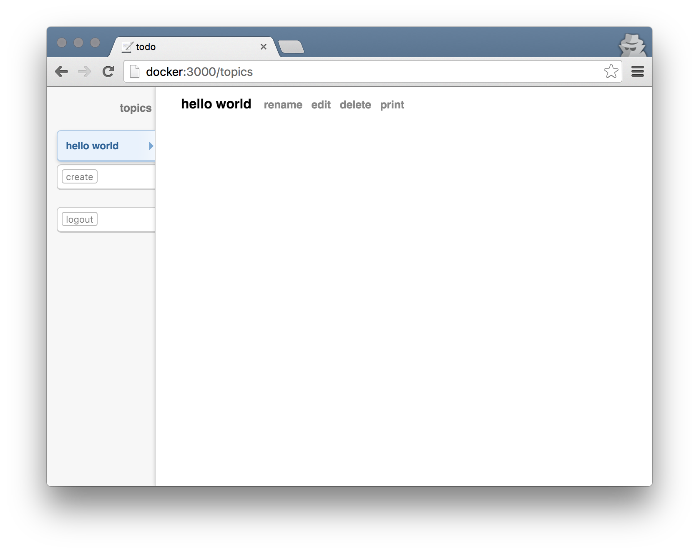

class: inverse, center, middle

# Docker
### FOSSCOMM 2016
#### Κωστής Καραντίας - @gtklocker

---

# Γιατί Docker;

TODO: matrix from hell

Πόσες φορές έχετε έρθει αντιμέτωποι με αυτό;
```
$ pip install psycopg2
Downloading/unpacking http://pypi.python.org/packages/source/p/psycopg2/psycopg2
-2.4.tar.gz#md5=24f4368e2cfdc1a2b03282ddda814160
  Downloading psycopg2-2.4.tar.gz (607Kb): 607Kb downloaded
  Running setup.py egg_info for package from http://pypi.python.org/packages/sou
rce/p/psycopg2/psycopg2-2.4.tar.gz#md5=24f4368e2cfdc1a2b03282ddda814160
    Error: pg_config executable not found.

    Please add the directory containing pg_config to the PATH
    or specify the full executable path with the option:

        python setup.py build_ext --pg-config /path/to/pg_config build ...

    or with the pg_config option in 'setup.cfg'.
    Complete output from command python setup.py egg_info:
    running egg_info
```

---

# Γιατί Docker;

Για να φτάσετε σε μια τέτοια λύση;



---

class: center, middle


---

# Γιατί Docker;

- Και πόσες ώρες έχετε ξοδέψει μονάχα για να τρέξετε ένα νεο codebase;
- Από το 2010 το *Vagrant* έλυσε αυτό το πρόβλημα.
    - Κάθε εφαρμογή έχει ένα πολύ συγκεκριμένο περιβάλλον το οποίο καθορίζεται αυστηρά (OS, dependencies, network, ...).
    - Αρκεί πλεον ένα `vagrant up` για να τρέξουν όλα αυτόματα και να μπορεί ο developer να αφοσιωθεί στο να αναπτύξει την εφαρμογή του.
    - Φεύγει ο χαμένος χρόνος που θα χρειαζόταν κανονικά για να τρέξει την εφαρμογή τοπικά.
- Είναι η πλεον διαδεδομένη λύση.
- Αρχικά το Vagrant χρησιμοποιούσε VMs για να κάνει όλα αυτά.
- Πλεον χρησιμοποιει και Docker containers! 😀

---

# Γιατί Docker containers;

- Έχουν μικρότερο overhead από ένα VM. 🍔
- Ξεκινάνε πιο γρήγορα από ένα VM. 🛫
- Είναι πιο γρήγοροι από ένα VM. 👌

---

# Docker containers

- Από τι αποτελείται ένας container;
    - Κυρίως ένα filesystem που λέμε image, σαν snapshot ενός VM.
    - Σε έναν container έχουμε συνήθως το userspace που χρειαζόμαστε και μια εφαρμογή.
    - Πχ. θα μπορούσαμε να έχουμε έναν container για nginx, έναν container για bitcoind
- Υπάρχουν έτοιμα images για οτιδήποτε μπορείτε να φανταστείτε στο Docker Hub (hub.docker.com).
    - Το userspace οποιασδήποτε διανομής θέλετε (Ubuntu, Debian, Arch, ...)
    - Όποια γνωστή εφαρμογή μπορείτε να σκεφτείτε.
    - Θα μιλήσουμε περισσότερο για images αργότερα.

---

# Baby steps

Θα τρέξουμε ένα container με το image του Ubuntu με το `docker run`.

```
➜  ~ docker run -it ubuntu /bin/bash
root@ba97fbda8ad1:/# ls
bin  boot  dev  etc  home  lib  lib64  media  mnt  opt  proc  root  run  sbin  srv  sys  tmp  usr  var
root@ba97fbda8ad1:/# apt-get update
Ign http://archive.ubuntu.com trusty InRelease
Get:1 http://archive.ubuntu.com trusty-updates InRelease [65.9 kB]
Get:2 http://archive.ubuntu.com trusty-security InRelease [65.9 kB]
Hit http://archive.ubuntu.com trusty Release.gpg
Hit http://archive.ubuntu.com trusty Release
Get:3 http://archive.ubuntu.com trusty-updates/main Sources [341 kB]
...
```

---

# Baby steps

- Το `ubuntu` είναι το όνομα του image που θα έχει ο container μας.
- Κάθε container έχει πρόσβαση στο δίκτυο.
- Σε κάθε container γίνεται αssign ένα id κι ένα όνομα.

```
➜  ~ docker ps
CONTAINER ID        IMAGE               COMMAND             CREATED             STATUS              PORTS               NAMES
a8c81857edd9        ubuntu              "/bin/bash"         6 seconds ago       Up 6 seconds                            sad_carson
```

---

# Χρήσιμες λειτουργίες.red[\*]

- `docker create`: σαν το run, αλλά δημιουργεί έναν container χωρίς να τον ξεκινήσει
- `docker pause $name`: παγώνει την εκτέλεση του container
- `docker unpause $name`
- `docker stop $name`: τερματίζει την εκτέλεση του container
    - Στέλνει SIGTERM στο process του container.
    - Με `docker ps -a` μπορούμε να δούμε όλους τους containers, ακόμα και αυτούς που είναι stopped.
- `docker kill $name`: σκοτώνει τον container
    - Στέλνει SIGKILL στο process του container.
- `docker start $name`: ξεκινάει έναν stopped/created container
- `docker logs $name`
- `docker attach $name`: μας συνδέει με το command που τρέχει ο container μας (αν πχ. το container τρέχει bash μας βάζει στο bash prompt)
- `docker rm $name`: διαγράφει έναν σταματημένο container (υπάρχει και το `rm -f` για running containers)

.footnote[.red[\*]Όπου `$name` εννοούμε είτε το όνομα είτε το id του container.]

---

class: inverse, center, middle

# Demo

---

# Images

Ας εγκαταστήσουμε nodejs στον container μας.
```
root@a8c81857edd9:/# apt-get update
[...]
root@a8c81857edd9:/# apt-get install nodejs
Reading package lists... Done
[...]
Setting up libc-ares2:amd64 (1.10.0-2) ...
Setting up libv8-3.14.5 (3.14.5.8-5ubuntu2) ...
Setting up nodejs (0.10.25~dfsg2-2ubuntu1) ...
update-alternatives: using /usr/bin/nodejs to provide /usr/bin/js (js) in auto mode
Processing triggers for libc-bin (2.19-0ubuntu6.6) ...
root@a8c81857edd9:/# nodejs --version
v0.10.25
```

---

# Images

- Από τη στιγμή που θα σβήσουμε τον container μας το nodejs θα χαθεί.
- Οι αλλαγές που κάνουμε δεν αποθηκεύονται στο image (ubuntu image στην περίπτωση μας).
- Μπορούμε να κρατήσουμε τις αλλαγές μας σε ένα καινούριο image με `docker commit $name`.

```
➜  ~ docker commit sad_carson
sha256:641c3875ed8b1da49904d47aee0f0a6ad6928e41aa2220d3b192d32a91687b9a
➜  ~ docker images
REPOSITORY                    TAG                 IMAGE ID            CREATED              SIZE
<none>                        <none>              641c3875ed8b        About a minute ago   235.5 MB
ubuntu                        latest              2a274e3405ec        9 months ago         188.3 MB
```

---

# Images

Και να τρέξουμε έναν container με αυτό το image.

```
➜  ~ docker run 641c3875ed8b nodejs --version
v0.10.25
```

### GREAT SUCCESS! 👏

Πάνω σε αυτό τον container και να συνεχίσουμε να κάνουμε commit και να δημιουργούμε νεα images.

---

# Images

- Τα images έχουν συνήθως όνομα που έχει την εξής μορφή: `user/name:tag`. (μπορείτε να σκεφτείτε το tag σαν έκδοση)
    - Το κομμάτι `user/name` λέγεται και repository.
- Μπορείτε να ορίσετε το δικό σας όνομα στο docker commit σαν έξτρα παράμετρο.

```
➜  ~ docker commit sad_carson gtklocker/nodejs:v0.10.25
sha256:eafb3beaebe865c3267469c115889c2cd3c49b7115063ef1c93a089ee7ef7bdd
➜  ~ docker images
REPOSITORY                    TAG                 IMAGE ID            CREATED             SIZE
gtklocker/nodejs              v0.10.25            eafb3beaebe8        3 seconds ago       235.5 MB
➜  ~ docker run gtklocker/nodejs:v0.10.25 nodejs --version
v0.10.25
```

---

# Images

- Μπορείτε να σβήσετε images με `docker rmi $image`.

---

# Άλλα χρήσιμα commands

- `docker run -d`: τρέχει τον container χωρίς να κάνει attach (σαν create & start)
- `docker exec`: τρέχει commands σε έναν running container, πχ
```
➜  ~ docker ps
CONTAINER ID        IMAGE               COMMAND                  CREATED             STATUS              PORTS                         NAMES
5c232174cef1        nginx               "nginx -g 'daemon off"   About an hour ago   Up About an hour    0.0.0.0:80->80/tcp, 443/tcp   jolly_wozniak
➜  ~ docker exec jolly_wozniak ps aux
USER       PID %CPU %MEM    VSZ   RSS TTY      STAT START   TIME COMMAND
root         1  0.0  0.2  31500  4412 ?        Ss   14:31   0:00 nginx: master process nginx -g daemon off;
nginx       12  0.0  0.1  31876  2752 ?        S    14:31   0:00 nginx: worker process
root        13  0.0  0.0  17492  2024 ?        Rs   16:20   0:00 ps aux
```

---

# Docker Hub

- Το ubuntu image που χρησιμοποιήσαμε είναι από το Docker Hub.
- Όταν κάνουμε run ένα image, το docker είτε
    - Το χρησιμοποιεί αν υπάρχει ήδη τοπικά.
    - Προσπαθεί να το βρει στο Docker Hub και αν το βρεί το κάνει pull και το χρησιμοποιεί.
- Υπάρχει ένα ξεχωριστό command για να κατεβάσουμε ένα image απο το Docker Hub.
```
➜  ~ docker pull alpine
Using default tag: latest
latest: Pulling from library/alpine
420890c9e918: Already exists
Digest: sha256:9cacb71397b640eca97488cf08582ae4e4068513101088e9f96c9814bfda95e0
Status: Downloaded newer image for alpine:latest
```
- Μπορούμε να τρέξουμε και να κάνουμε pull κάποιο image από το Docker Hub με συγκεκριμένο tag.
- Όταν κάνουμε pull χωρίς το `user` κομμάτι που είδαμε πριν εννοείται πως `user=library` (επίσημα images).
- Όταν κάνουμε pull χωρίς το `tag` κομμάτι που είδαμε πριν εννοείται πως `tag=latest`.

---

# Docker Hub

- Αφού έχουμε φτιάξει το image μας μπορούμε να κάνουμε push στο Docker Hub.
- Χρειάζεται πρώτα να φτιάξουμε ένα account, είτε στο hub.docker.com είτε με το `docker login`.

```
➜  ~ docker login
Username: gtklocker
Password:
Email: karantiaskostis@gmail.com
WARNING: login credentials saved in /Users/gtklocker/.docker/config.json
Login Succeeded
➜  ~ docker push gtklocker/nodejs:v0.10.25
The push refers to a repository [docker.io/gtklocker/nodejs]
3f1c5faeea3b: Pushed
5f70bf18a086: Mounted from docker/whalesay
1debe0af080b: Pushed
3a669db069a2: Pushed
d0df3aaac661: Pushed
v0.10.25: digest: sha256:8d4549203fcaa204fff7ecc0f7a164f4d0672be22fced43db251eee02e924d69 size: 4399
```

- Αφού ανέβει μπορεί οποιοσδήποτε στον κόσμο απλά να χρησιμοποιήσει το image μας με όνομα `gtklocker/nodejs:v0.10.25`.
- Μπορούμε να ψάξουμε images στο Hub με `docker search`.

---

class: dive-deep, center, middle

# Docker internals

---

# Moar images

- Το filesystem των images είναι ένα union filesystem.
    - Αυτό σημαίνει ότι παίρνει πολλά layers από filesystems και τα συνδυάζει.
    - Συνήθως overlayfs ή AUFS.
- Όταν κάναμε commit πριν, φτιάξαμε απλά ένα layer/patch/diff/delta για το ubuntu image.
- Μπορούμε να δούμε το ιστορικό layers μιας εικόνας με το `docker history`.

```
➜  ~ docker history gtklocker/nodejs:v0.10.25
IMAGE               CREATED             CREATED BY                                      SIZE                COMMENT
eafb3beaebe8        13 hours ago        /bin/bash                                       47.2 MB
2a274e3405ec        9 months ago        /bin/sh -c #(nop) CMD ["/bin/bash"]             0 B
df697c8b1bf4        9 months ago        /bin/sh -c sed -i 's/^#\s*\(deb.*universe\)$/   1.895 kB
371166fb96e0        9 months ago        /bin/sh -c echo '#!/bin/sh' > /usr/sbin/polic   194.5 kB
69191ca023af        9 months ago        /bin/sh -c #(nop) ADD file:c8f078961a543cdefa   188.1 MB
```

---

# Moar images



---

# Moar containers

- Μοιάζουν με συνδυασμό chroot + cgroups + namespace isolation.
- Τα cgroups επιτρέπουν να έχουμε groups απο processes.
- Μπορούμε να περιορίσουμε resources σε groups όπως:
    - RAM
    - CPU
    - I/O
- Isolation υπάρχει σε
    - PID: ένα group διεργασιών δε μπορεί να δει άλλα PIDs εκτός από τα δικά του
    - Mount: ένα group διεργασιών μπορεί να έχει εντελώς δικά του mount points
    - User: ένα group διεργασιών μπορεί να δει μόνο τα δικά του user ids (not used by default)
    - και άλλα...
- Όλα αυτά είναι πολύ πρόσφατα (Linux) kernel features.
- Το docker χρησιμοποιεί το libcontainer που διαχειρίζεται όλα αυτά.

---

# Overhead

- Τα processes είναι isolated όμως τρέχουν κανονικά στο host.
- Επομένως δεν υπάρχει **CPU performance hit**.
- Το **memory performance hit** είναι επίσης σχεδόν μηδαμινό.
- Όπως και το **network performance hit**.
- 😄

---

# Networking

Ας τρέξουμε το image του nginx.

```
➜  ~ docker run -d nginx
4a5574206216a269cec6a69fac949032764d09795e524a322b7de10b3848dc15
```

---

class: center, middle



---

# Networking

Γιατί; Ίσως ένα `docker ps` να διαλευκάνει την υπόθεση.

```
➜  ~ docker ps
CONTAINER ID        IMAGE               COMMAND                  CREATED             STATUS              PORTS               NAMES
4a5574206216        nginx               "nginx -g 'daemon off"   2 seconds ago       Up 1 seconds        80/tcp, 443/tcp     jovial_khorana
```

- Βλέπουμε ότι κάτι υπάρχει στην port 80, αλλά γιατί δε μπορούμε να το δούμε;
- Πρέπει να πούμε στο docker να κάνει *map* την 80 σε κάποια port στο host μας ώστε να μπορούμε να τη δούμε. 
- Το κάνουμε με το `-p <host port>:<container port>` option στο run.

```
➜  ~ docker run -d -p 80:80 nginx
e40b303836c20a023f16620abd68e64986de877e05a6bd17be23e48615c2bf0f
```

---

class: center, middle



---

# Networking

Μπορούμε να δούμε περισσότερες λεπτομέρειες για τις ports του container μας με το `ps` ή και το `inspect`.

```
➜  ~ docker inspect -f '{{ .NetworkSettings.Ports }}' high_newton
map[443/tcp:[] 80/tcp:[{0.0.0.0 80}]]
➜  ~ docker ps
CONTAINER ID        IMAGE               COMMAND                  CREATED             STATUS              PORTS                         NAMES
e40b303836c2        nginx               "nginx -g 'daemon off"   4 minutes ago       Up 3 minutes        0.0.0.0:80->80/tcp, 443/tcp   high_newton
```

---

# Environment variables

- Με `-e KEY=VALUE` μπορούμε να περνάμε environment variables στους containers μας.
- Τι environment variables περιμένει το κάθε image είναι συνήθως documented στη σελίδα του στο Docker Hub.
πχ. PostgreSQL



---

# Links

Ας τρέξουμε μια ένα λίγο περίπλοκο web app. Το `mssola/todo` φαίνεται να είναι ένα Todo app.

Διαβάζουμε το README του στο Docker Hub για να πάρουμε μια ιδέα για το πώς να το τρέξουμε.

---

class: center, middle



---

# Links

- Θα τρέξουμε έναν container για την PostgreSQL που χρειάζεται το todo app μας (db container).
- Θα κάνουμε τα migrations που χρειάζεται για να τρέξει σωστά.
- Τρέχοντας το todo app container το ενημερώνουμε για ένα link με το db container (με `--link <container id>:<alias>`).
- Το alias που δηλώνουμε έχει πολλές ιδιότητες. Μια από αυτές είναι ότι ο container μας βλέπει τον container που του κάναμε link στο host `<alias>`.
- Επομένως το todo app container μας μπορεί να δει την postgres στο db:5432.

```
➜  ~ docker run -d --name db -e POSTGRES_PASSWORD=suchsecretwow -e POSTGRES_DB=todo-dev postgres
50779a64f832f42f7bcfa4e4a3c525117fa03e024d56a81f1adeaebfa51b5020
➜  ~ docker exec -i db psql -U postgres todo-dev < tables.sql
CREATE TABLE
CREATE TABLE
➜  ~ docker run -d --name web -e TODO_DB_PASSWORD=suchsecretwow -e TODO_DB_HOST=db --link db:db -p 3000:3000 mssola/todo
abb9a566115a867afecc2b3e01fcf73a3fd7ae594dfe9941a10a0637e8213628
➜  ~ docker ps
CONTAINER ID        IMAGE               COMMAND                  CREATED             STATUS              PORTS                    NAMES
abb9a566115a        mssola/todo         "./todo"                 23 hours ago        Up 36 seconds       0.0.0.0:3000->3000/tcp   web
50779a64f832        postgres            "/docker-entrypoint.s"   23 hours ago        Up 41 seconds       5432/tcp                 db
```

---

class: center, middle



---

# Links

Όχι, δε σας φαίνεται μόνο, είναι λίγη αλλά και πάλι αρκετή δουλειά για να τρέξουμε μια τέτοια εφαρμογή.

Θα δούμε έναν καλύτερο τρόπο στη συνέχεια.

---

# Volumes

- Μπορούμε να μοιραζόμαστε δεδομένα με το host OS μέσω volumes.
- `-v <host path>:<container mountpoint>`

```
➜  mkdir -p mydockerfiles/{1..10}
➜  cd mydockerfiles
➜  docker run --rm -v `pwd`:/mnt/host ubuntu ls -la /mnt/host
total 4
drwxr-xr-x 1 1000 staff  408 Apr 15 12:21 .
drwxr-xr-x 3 root root  4096 Apr 15 12:22 ..
drwxr-xr-x 1 1000 staff   68 Apr 15 12:21 1
drwxr-xr-x 1 1000 staff   68 Apr 15 12:21 10
drwxr-xr-x 1 1000 staff   68 Apr 15 12:21 2
drwxr-xr-x 1 1000 staff   68 Apr 15 12:21 3
drwxr-xr-x 1 1000 staff   68 Apr 15 12:21 4
drwxr-xr-x 1 1000 staff   68 Apr 15 12:21 5
drwxr-xr-x 1 1000 staff   68 Apr 15 12:21 6
drwxr-xr-x 1 1000 staff   68 Apr 15 12:21 7
drwxr-xr-x 1 1000 staff   68 Apr 15 12:21 8
drwxr-xr-x 1 1000 staff   68 Apr 15 12:21 9
```

---

# Volumes

- Μπορούμε να ορίσουμε αν το volume θα είναι read-only.
- `-v <host path>:<container mountpoint>:ro`

```
➜  docker run --rm -v `pwd`:/mnt/host:ro ubuntu touch /mnt/host/somefile
touch: cannot touch '/mnt/host/somefile': Read-only file system
```

---

# Volumes

Τα volumes χρησιμεύουν και απλά για να κάνουν persist τα δεδομένα ενός container. Υπάρχουν πολλοί λόγοι για κάτι τέτοιο.

- Κανένα volume δε σβήνεται ποτέ (αυτόματα), ακόμα και αν ο container που το χρησιμοποιούσε έχει διαγραφεί.
- Κάποια δεδομένα που θα δημιουργήσει ο container είναι ευαίσθητα και δε θέλουμε να τα χάσουμε, ανεξάρτητα του πως θα καταλήξει ο container.
- Δεδομένα όπως logs, caches, γενικά είναι άχρηστα και δεν τα θέλουμε σε περίπτωση που κάνουμε commit.
    - Performance: δε χρειάζεται να επεξεργάζεται το docker αυτά τα αρχεία πάνω απο το image layer
- Reuse από άλλα containers (με `--volumes-from`).
    - πχ. container με nginx έχει volume για τα logs, ένας άλλος container χρησιμοποιεί αυτό το volume για να βγάλει στατιστικά με βάση τα logs
    - ή shared db

---

# Privileged containers

TODO

---

# Dockerfiles

- Πίσω στα images, το να δημιουργούμε νεα images με commit δε φαίνεται τόσο πρακτικό.
- Επίσης είναι δύσκολο να κάνεις reason για το τι αλλαγές έχουν ακριβώς γίνει σε ένα commit.
- Γι'αυτό το Docker χρησιμοποιεί Dockerfiles για να χτίζει images με έναν πιο ξεκάθαρο τρόπο.
- Χτίζουμε images με `docker build` στον κατάλογο που υπάρχει το Dockerfile μας.
    - Ο κατάλογος στον οποίο βρίσκεται το Dockerfile είναι συνήθως το build context.

```
➜  docker build -t gtklocker/hello-fosscomm:v2 .
Sending build context to Docker daemon 209.7 MB
Step 1 : FROM docker/whalesay
 ---> 6b362a9f73eb
Step 2 : RUN apt-get update &&     DEBIAN_FRONTEND=noninteractive apt-get install -y lolcat &&     apt-get clean &&     rm -rf /var/lib/apt/lists/* /tmp/* /var/tmp/*
 ---> Using cache
 ---> 5d0953e52f54
Step 3 : CMD sh -c 'cowsay "Good morning FOSSCOMM!"|/usr/games/lolcat -f'
 ---> Using cache
 ---> 195593f1f362
Successfully built 195593f1f362
```

---

# Dockerfiles

Το συντακτικό τους έχει αυτή την πολύ απλή μορφή:

```dockerfile
# Comment
INSTRUCTION arguments
```

---

# Dockerfiles

Ας φτιάξουμε πάλι το δικό μας image με nodejs.

```dockerfile
FROM ubuntu

RUN apt-get update && \
    DEBIAN_FRONTEND=noninteractive apt-get install -y nodejs
```

Ένα μεγάλο ποσοστό Dockerfiles είναι περίπου ίδιο με αυτό.

---

# Dockerfiles

Ας δούμε τι κάνει αυτό το Dockerfile:

```dockerfile
FROM ubuntu
```

Λέμε στο Docker να χρησιμοποιήσει το ubuntu image σαν βάση. Το πρώτο instruction πρέπει πάντα να είναι `FROM`.

Όταν κάνουμε build φτιάχνει έναν προσωρινό container με αυτό το image, εκτελεί κάθε ένα από τα επόμενα instructions και μετά απο κάθε ένα κάνει commit (και run το commited image) μέχρι να φτάσει στο τέλος.

```dockerfile
RUN apt-get update && \
    DEBIAN_FRONTEND=noninteractive apt-get install -y nodejs
```

Η εντολή μετά το `RUN` τρέχει μέσα σε αυτό τον container.

---

# Dockerfiles (CMD)

```dockerfile
CMD ["nodejs", "server.js"]
```

Το CMD ορίζει ως default command (το command που τρέχει αν δεν ορίσουμε κάποιο κατά το create/run) το `nodejs server.js`. Η μορφή που είναι γραμμένο λέγεται exec form και προτιμάται απο το

```dockerfile
CMD nodejs server.js
```

που θα ήταν επίσης έγκυρο.

---

# Dockerfiles (WORKDIR)

```dockerfile
WORKDIR /path/to/workdir
```

Σκεφτείτε το σαν cd για ολόκληρο το Dockerfile.

*Quiz*: Είναι ίδιο με το
```dockerfile
RUN cd /path/to/workdir
```
?

---

# Dockerfiles (WORKDIR)

```dockerfile
WORKDIR /path/to/workdir
```

Σκεφτείτε το σαν cd για ολόκληρο το Dockerfile.

*Quiz*: Είναι ίδιο με το
```dockerfile
RUN cd /path/to/workdir
```
?

Όχι! Το `RUN` θα τρέξει, θα γίνει commit, και όταν τρέξει το commited image για να συνεχίσει το build το working directory πιθανότατα θα είναι άλλο!

---

# Dockerfiles (COPY)

```dockerfile
COPY <src> ... <dest>
```

Αντιγράφει το `<src>` στο `<dest>` μέσα στον container. Το `<src>` είναι relative path στο build context (και πρέπει να ανήκει αυστηρά μέσα σε αυτό!).

πχ.
```dockerfile
COPY API/ /usr/src/app/
```

Αντιγράφει τα περιεχόμενα του API/ στο /usr/src/app.

Αν τα paths μας περιέχουν whitespace χρησιμοποιούμε
```dockerfile
COPY ["<src>", ..., "<dest>"]
```

---

# Dockerfiles (ENV)

```dockerfile
ENV <key> <value>
```
ή
```dockerfile
ENV <key>=<value> <secndkey>=<secndvalue> ...
```

Ορίζει environment variables που ισχύουν:
- Κάθε φορά που τρέχει το image που θα φτιαχτεί (σαν το `-e` που είδαμε πριν)
- Μέσα στο Dockerfile πχ.
```dockerfile
ENV repoPath /mystartup/app/seedroundversion
WORKDIR ${repoPath}/src/
```

---

# Dockerfiles (ENTRYPOINT)

```dockerfile
ENTRYPOINT ["executable", "param1", "param2"]
```

Κάνει το `docker run <args>` να συμπεριφέρεται σαν το executable που θα ορίσουμε. Το command (CMD) που θα ορίζαμε κανονικά, τώρα θα αποτελεί όρισμα για το entrypoint.

πχ. αν ορίσουμε σαν entrypoint το ls και σαν command το -h τότε θα πάρουμε το help του ls μόλις τρέξουμε το image.

Μπορούμε να το αλλάξουμε κατά το run/create με το argument `--entrypoint`.

Το default ENTRYPOINT είναι το `/bin/sh -c`.

---

# Dockerfiles (VOLUME)

```dockerfile
VOLUME ["/data"]
```

Αντίστοιχο του `-v /data` που είδαμε πριν.

---

# Dockerfiles (EXPOSE)

```dockerfile
EXPOSE <port> [<port>...]
```

Λεει στο docker ότι κάτι κάνει listen στην `<port>`. Αυτός είναι ο τρόπος που το `docker ps` πριν ήξερε ότι κάτι υπάρχει στην port 80 του nginx container.

Αν κάποιος container κάνει link με έναν που έχει exposed ports τότε μπορεί να τις δει και να επικοινωνήσει με τα services σε αυτές (όπως πριν το web app container με το Postgres container).

---

# Docker hipster
